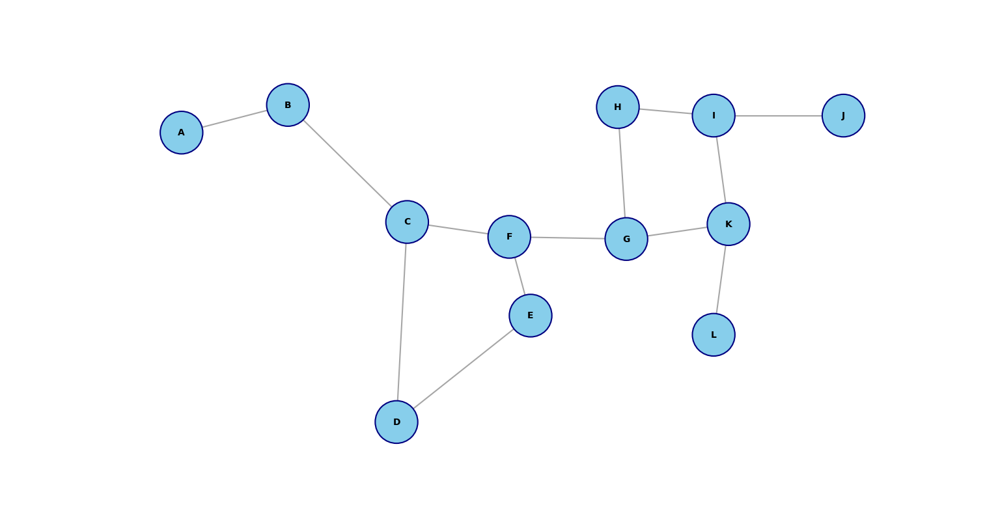

# Synthetic Graphs Image Generator

A procedural graph generation system that creates JSON labels for graph datasets (compatible with formats like [CSDia](https://github.com/WayneWong97/CSDia)).

Built in Rust for performance, using a **grid-constrained structural noise** algorithm that produces organic-looking graphs with human-drawn characteristics.

## Algorithm Characteristics

- **Grid-based random walk** with spatial constraints
- **Anti-clustering behavior** ([blue noise-inspired ](https://developer.nvidia.com/blog/rendering-in-real-time-with-spatiotemporal-blue-noise-textures-part-1/) distribution)
- **Organic branching patterns** with controlled density
- **Structural noise** for natural-looking graph topology

The algorithm prevents node overlap while maintaining random, human-like placement and connection patterns.

## Example Output


## Features

- **Configurable parameters**: grid size, node radius, branching factors
- **JSON output** compatible with graph dataset formats
- **Performance-optimized** Rust implementation
- **Natural-looking results** that resemble hand-drawn diagrams

## Usage

```bash
cargo run
```

Generates `graph.json` with vertex and edge data suitable for rendering or further processing.